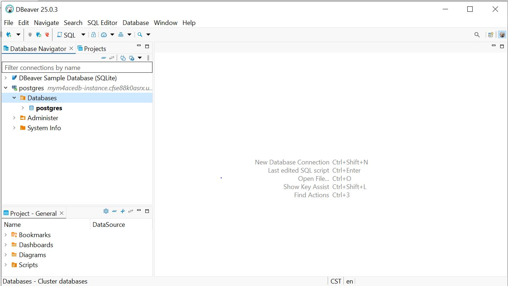

# AWS Database Services Assignment

**1 Launch an RDS instance and connect to it using a database client.**

Step-by-Step: Launching an RDS Instance & Connecting to It

**Step 1: Sign in to AWS Console**

i. Go to https://console.aws.amazon.com
ii. Use your credentials to log in.

**Step 2: Open Amazon RDS**

i. In the AWS Management Console, search for "RDS" in the Services menu.
ii. Click "RDS" to open the dashboard.

**Step 3: Create a Database**

i. Click "Create database".
ii. Choose Standard Create for more control.
ii. Engine options: Choose a database engine like:

MySQL

PostgreSQL

MariaDB

(For my assignment, I choose PostgreSQL).

**Step 4: Configure Database Settings**

i. DB instance identifier: e.g., mydbinstance.
ii. Master username: e.g., admin.
iii. Master password: Enter a strong password.
iv. DB instance size: Use the Free Tier options if available (e.g., db.t3.micro).
v. Storage: Default is okay unless specified otherwise.

**Step 5: Set up Connectivity**

i. Virtual Private Cloud (VPC): Leave as default unless you have a custom setup.
ii. Public access: Select Yes (so you can connect from your client).
iii. VPC security group: Choose Create new or select an existing one.
iv. Make sure the security group allows inbound access on the DB port:
v. MySQL: 3306
vi. PostgreSQL: 5432

**Step 7: Create the Database**
i. Click "Create database".
ii. Wait a few minutes while AWS provisions the RDS instance.

**Step 8: Get the Endpoint**

i. Go to the RDS Dashboard > Databases.
ii. Click your instance name.
iii. Copy the Endpoint and Port (you’ll use them in your DB client).

**Step 9: Connect Using a Database Client**

Depending on the engine you chose, For my PostgreSQL, I used DBeaver.

i. Open your client app
ii. Create a new connection:
    Host: RDS endpoint
    Port: 5432
    Database: Name of the DB you set (or postgres)
    User: admin (or yours)
    Password: enter your password.
iii. Connect!

**2. Practice basic SQL operations (create, read, update, delete) on the database.**

**i. To create simple table on the database, click on the SQL Editor and run this script;**

CREATE TABLE datasets (
    PersonID INT,
    name VARCHAR(100),
    address VARCHAR(100),
    email VARCHAR(100),
    city VARCHAR(100),
    age INT
);

**ii. Insert Data, you run this script;**

INSERT INTO
DATASETS ( PersonID, name, address, city, email, age)
VALUES (1, 'tobisolarin', 'st john', 'Lagos', 'tobisolarin@example.com', 25)

***iii. To Read to fetch Data, You run this script;**

SELECT * FROM datasets;

**iv. To Update-Modify data, you run this script;**

UPDATE datasets
SET age = 26
WHERE name = 'tobisolarin';

You will notice the age of tobisolarin is updated to from 25 to 26 once you run the script;

SELECT * FROM datasets;

**V. To Delete - Remove Data, you run this script**

DELETE FROM users
WHERE name = 'maryjane';

You will notice maryjane data is deleted from the datasets once you run the script;

SELECT * FROM datasets;

**3. Set up and test DynamoDB for a simple key-value store**

**1. Sign in to AWS Console**

i. Visit https://console.aws.amazon.com
ii. Log in with your credentials.

**Step 2: Open DynamoDB**

i. In the Search bar, type and select DynamoDB.
ii. This will open the DynamoDB dashboard.

**Step 3: Create a Table**

i. Click "Create table"

ii. Fill in:

    Table name: KeyValueStore (or any name)

    Partition key: key (Type: String)

    Leave Sort key unchecked (optional for simple key-value)

iii. Set Read/Write capacity mode:

    Choose On-demand (for testing, no need to provision capacity)

iv. Click Create table

**Step 4: Add an Item (Create)**

i. Go to your table.
ii. Click "Explore table items" → "Create item"
iii. Switch to Tree or Text view

Add an item using the Json script:

{
  "key": "username",
  "value": "tobisolarin"
}

iv. Create item.

**Step 5: Read an Item**

i. Go back to Explore table items

ii. Use "Search by partition key":

iii. Enter: username

     You’ll see the value: "tobisolarin"

**Step 6: Update an Item**

i. Click the item from the list

ii. Click "Edit"

iii. Change the value using the Json command;

{
  "key": "username",
  "value": "tobi_updated"
}

